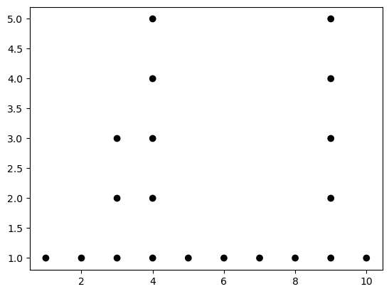
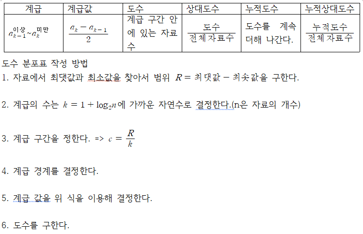
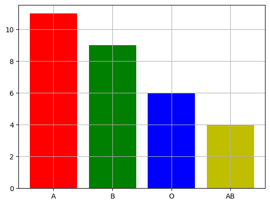
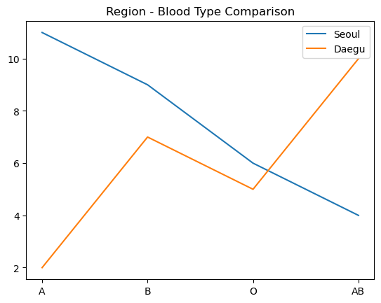
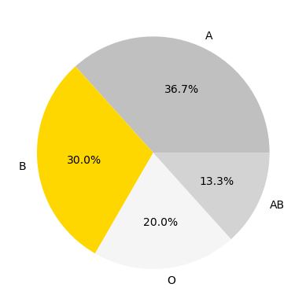
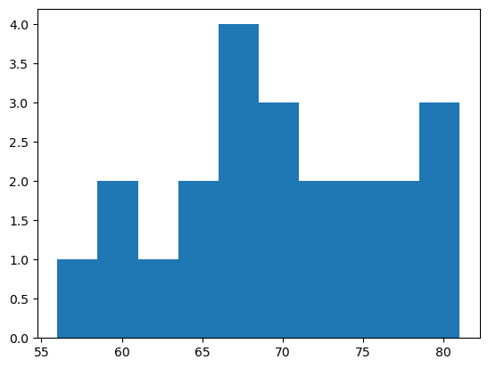
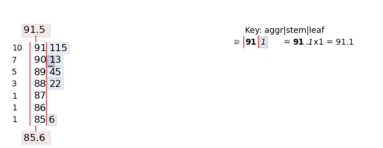
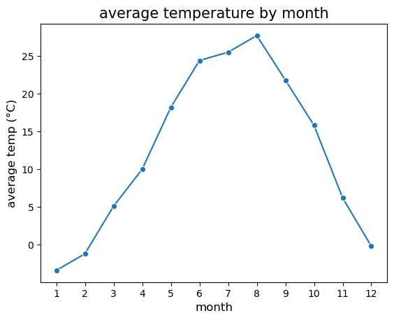

---
title:  "[확통]기본 용어 정리"
categories:
  - PAS
---  
# 확률 및 통계학

# 기본 용어 정리

## 통계
- 데이터(Data) : 어떤 통계적 목적에 맞게 수집된 정보(양적, 질적, 범주형 자료 등으로 나뉨)
- 통계학(Statistics) : 효과적인 의사 결정을 내리기 위해 자료를 수집, 요약, 분석, 표현, 판단하는 과학의 한 분야
- 통계학은 기술통계학(Descriptive Statistics), 추측통계학(Inferential Statistics)로 나뉜다.

### 기술통계학과 추측통계학
- 기술통계학 : 자료를 수집하고 정리하여 표, 그래프, 그림 등으로 나타내고 자료가 갖는 수치적 특성을 분석하고 설명하는 방법을 다루는 통계학의 한 분야
- 추측통계학 : 표본을 대상으로 얻은 정보로부터 모집단의 특성을 추론하는 방법을 다루는 통계학의 한 분야

## 모집단과 표본
- 모집단(Population) : 통계적 분석을 위한 관심의 대상
- 모집단의 크기(Population Size) : 모집단을 이루는 자료의 개수
- 표본(Sample) : 모집단의 일부분
- 표본의 크기(Sample Size) : 표본을 이루는 자료의 개수

## 통계 조사 방법
- 전수 조사(Census) : 모든 조사 대상을 상대로 조사하는 방법
- 표본 조사(Sample survey) : 조사 대상의 일부를 상대로 조사하는 방법
- 임의 추출(Random Sampling) : 각각의 요소들이 선정될 가능성은 같다고 생각하고 표본을 선택하여 조사하는 방법

# 질적 자료의 정리 방법

## 점도표
- 가로축 : 각 범주를 기입
- 가로축 위에 측정값의 관찰 횟수를 점으로 나타냄
- 양적 자료에 사용 가능


```python
# 필요한 라이브러리 임포트
import warnings
import numpy as np
import matplotlib.pyplot as plt
warnings.filterwarnings("ignore")
import pandas as pd
import stemgraphic

# 점도표를 그리기 위한 데이터 생성
data =[1, 2, 3, 3, 3, 4, 4, 4, 4, 4, 5, 6, 7, 8, 9, 9, 9, 9, 9, 10]

# 계급 구간 생성
bins = np.arange(11) + 0.5

# 도수를 구하여 hist변수에 저장
hist, edge = np.histogram(data, bins)
y = np.arange(1,hist.max()+1) # y(도수) 범위
x = np.arange(10) + 1         # x(데이터 속성값) 범위
X, Y = np.meshgrid(x,y)       # x-y 평면 범위(격자형태)

plt.scatter(X,Y, c=Y<=hist, cmap="Greys")
plt.show()
```


    

    


## 도수분포표
- 계급값 : 각 계급 구간의 처음과 끝의 평균
- 도수 : 각 범주 안에 들어있는 자료의 수
- 상대도수 : 각 범주 안의 도수를 전체 자료수로 나눈 값
- 범주 백분비율 : 상대도수에 100을 곱한 값


- 위 자료에는 간략히 하나만 해놓았지만 계급 구간은 여러 개이고 그에 따라 다른 값들도 여러 개이다.

## 막대 그래프
- 질적자료의 각 범주를 수평축에 나타내고 범주에 대응하는 도수를 수직 막대로 나타낸 그림


```python
# 혈액형 데이터 생성
x = np.arange(4)
blood_type = ['A', 'B', 'O', 'AB']
person = [11, 9, 6, 4]

# 막대 그래프 그리기
plt.bar(x, person, color = ['r', 'g', 'b', 'y'])
plt.grid()
plt.xticks(x, blood_type)

plt.show()
```


    

    


## 파레토 그래프
- 질적 자료의 각 범주를 수평축에 나타내고 범주에 대응하는 도수를 수직 막대로 나타낸 그림을 도수가 감소하도록 재배열한 그림
- 순서를 재배열 하므로 순서가 있는 자료에는 적합하지 않음.

## 꺾은 선 그래프
- 막대그래프의 중심을 직선으로 연결하여 각 범주를 비교하는 그래프
- 여러 자료를 비교하기 편리하다.


```python
# 지역별 혈액형 데이터 생성
blood_type = ['A', 'B', 'O', 'AB']
seoul= [11, 9, 6, 4]
daegu = [2, 7, 5, 10]

plt.plot(blood_type, seoul)
plt.plot(blood_type, daegu)
plt.legend(['Seoul', 'Daegu'])
plt.title('Region - Blood Type Comparison')

plt.show()
```


    

    


## 원 그래프
- 질적 자료의 각 범주에 대한 비율 관계를 상대적으로 나타낸 비율 그래프
- 중심각 = 백분위 * 360


```python
# 혈액형 데이터 생성
blood_type = ['A', 'B', 'O', 'AB']
person= [11, 9, 6, 4]
colors = ['silver', 'gold', 'whitesmoke', 'lightgray']

plt.pie(person, labels=blood_type, autopct='%.1f%%', colors = colors)
```


    ([<matplotlib.patches.Wedge at 0x234dd8829d0>,
      <matplotlib.patches.Wedge at 0x234dd86c390>,
      <matplotlib.patches.Wedge at 0x234dd777dd0>,
      <matplotlib.patches.Wedge at 0x234dd878a10>],
     [Text(0.4474102822939058, 1.0049000145774145, 'A'),
      Text(-1.093974074857458, -0.11498140519131432, 'B'),
      Text(0.11498145640393657, -1.0939740694747888, 'O'),
      Text(1.004900077411765, -0.44741014116560773, 'AB')],
     [Text(0.2440419721603122, 0.5481272806785896, '36.7%'),
      Text(-0.5967131317404315, -0.06271713010435326, '30.0%'),
      Text(0.06271715803851086, -0.5967131288044302, '20.0%'),
      Text(0.5481273149518717, -0.24404189518124056, '13.3%')])


    

    


# 양적 자료의 정리 방법

## 히스토그램
- 도수분포표를 그래프로 나타낸 그림
- y축은 도수, x축은 계급구간으로 나타냄


```python
weight = [68, 81, 64, 56, 78, 74, 61, 77, 66, 68, 59, 71,
          80, 59, 67, 81, 69, 73, 69, 74, 70, 65]

plt.hist(weight)

plt.show()
```


    

    


## 줄기와 잎 그림
- 줄기와 잎을 구분한다.(변동이 적은 부분을 줄기, 변동이 많은 부분을 잎으로 설정)
- 줄기 부분은 작은 수부터 나열하고 잎 부분은 원래 자료의 관측 순서대로 나열한다.
- 잎 부분의 관측값을 작은 수부터 나열한다.
- 전체 자료의 중앙에 놓이는 관측값이 있는 행의 맨 앞에 괄호를 만들고 괄호 안에 그 행의 잎의 수를 기입한다.
- 괄호가 있는 행을 중심으로 괄호와 동일한 열에 있는 누적도수를 위와 아래 방향에 각각 기입하고 최소 단위와 전체 자료 수를 기입한다.


```python
# 데이터 생성
data = [91.1, 88.2, 91.1, 90.3, 91.5, 85.6, 90.1, 88.2, 89.4, 89.5]

# stemgraphic라이브러리를 사용해서 쉽게 그릴 수 있다.
stemgraphic.stem_graphic(data)
```


    (<Figure size 750x250 with 1 Axes>, <Axes: >)


    

    


## 시계열 그림
- 시간에 따른 그래프이다.


```python
# 데이터 생성
data = pd.DataFrame({"월": [1, 2, 3, 4, 5, 6, 7, 8, 9, 10, 11, 12],
    "평균 기온 (°C)": [-3.4, -1.2, 5.1, 10.0, 18.2, 24.4, 25.5, 27.7, 21.8, 15.8, 6.2, -0.2]})

# 시계열 그래프
sns.lineplot(x='월', y='평균 기온 (°C)', data=df, marker='o')

# 그래프 제목 및 레이블
plt.title('average temperature by month', fontsize=15)
plt.xlabel('month', fontsize=12)
plt.ylabel('average temp (°C)', fontsize=12)
plt.xticks(ticks=[1, 2, 3, 4, 5, 6, 7, 8, 9, 10, 11, 12])

# 그래프 출력
plt.show()
```


    

    

